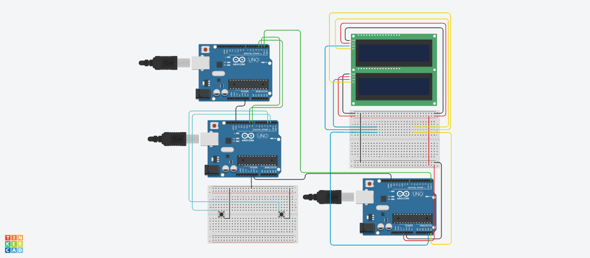

# Arcade Game: Three-Arduino Lane Dodger (Tinkercad)

This is a simple arcade-style dodging game built in Tinkercad Circuits. The player is an arrow character that sits in a fixed position on a three-lane road. Obstacles scroll toward the player from the right, and two buttons move the arrow up or down between lanes to avoid them. The score increases on every step the player survives, and the game speeds up as the score climbs.

The point of the project is not the game itself. It is the architecture. The work is split across three separate Arduino Uno boards that each do one job and pass information to the next board: one board reads the buttons, one board runs the game rules, and one board drives the screen. Real arcade cabinets and game consoles were built the same way, with a separate input controller, a main processor, and a dedicated graphics chip, because one slow processor cannot read inputs, calculate a game world, and repaint a screen fast enough on its own. The display is made from two 16x2 LCD modules stacked vertically so they behave as a single 16x4 screen.

🔗 **Tinkercad simulation:** [open the circuit](https://www.tinkercad.com/things/dtQ9hIT76sJ-arcade-game)

---

## How it works

The three boards form a one-way chain. Information only ever travels in one direction: A to B to C. No board ever sends anything back up the chain. This keeps the wiring simple and means no board has to wait for a reply.

| Board | Job | Gets input from | Sends output to |
|---|---|---|---|
| Arduino A | Input handler. Reads the two buttons and reports which are held. | Two pushbuttons | Arduino B, over two plain digital wires |
| Arduino B | Game logic. Holds the road, moves the player, spawns obstacles, detects crashes, keeps score. | Arduino A | Arduino C, over a serial data link |
| Arduino C | Display driver. Receives a full picture of the screen and paints it onto the two LCDs. | Arduino B | The two LCD modules, over I2C |

The two links work in completely different ways, and it is worth understanding why.

**A to B uses level signalling.** A "level" signal just means a wire that is held HIGH (5 V) or LOW (0 V). Arduino A sets its output pin HIGH for as long as a button is physically held down. Arduino B watches that wire and looks for the moment it changes from LOW to HIGH. That moment is called a "rising edge". By reacting only to the edge and not to the level, B treats a button held down for three seconds as a single press instead of hundreds of presses.

**B to C uses serial.** Serial means sending data one bit at a time down a single wire, at an agreed speed. Both boards are set to 9600 baud, which means 9600 bits per second. B sends the entire screen as a block of characters every time something changes.

### Game states

The game on Arduino B is a state machine. A state machine means the program is always in exactly one named state, and it only responds to input in the way that state allows.

| State | Number | Bottom line of screen shows | What a button press does |
|---|---|---|---|
| Waiting | 0 | `Press to start!` | Starts a new game |
| Playing | 1 | `Score: <n>` | Moves the player up or down one lane |
| Crashed | 2 | `CRASH! Score <n>` | Starts a new game, but only after 1 second has passed |

The 1 second lockout after a crash exists so that the button press that caused the crash does not immediately restart the game before the player has read their score.

### Frame format

A "frame" is one complete picture of the screen, sent as a single message. Arduino B builds the frame and Arduino C draws it. The frame is always exactly 66 bytes.

| Part | Size | Meaning |
|---|---|---|
| `{` | 1 byte | Start marker. Tells C that a new frame is beginning. |
| Road data | 48 bytes | 3 lanes of 16 characters each. A space is empty road, `#` is an obstacle. |
| Status line | 16 bytes | The bottom row of text, padded to exactly 16 characters. |
| `}` | 1 byte | End marker. Tells C the frame is complete and safe to draw. |

The start and end markers are what make the link reliable. If C is switched on halfway through a frame, it will see characters with no `{` before them and throw them away. It only draws when it has received a `{`, exactly 64 characters, and then a `}`. A damaged frame is discarded rather than drawn as garbage.

The player character is not stored in the road array. Arduino B inserts it into the frame as it is being sent, at lane `playerLane`, column 1. It is drawn as `>` while playing and `X` after a crash.

### How the 16x4 screen is built

Each LCD module is 16 characters wide and 2 rows tall. Stacking two of them gives 4 rows. Arduino C converts the position in the 64-character frame into a physical LCD and row.

| Frame positions | Screen row | Physical LCD | Row on that LCD | Contents |
|---|---|---|---|---|
| 0 to 15 | 0 | Top | 0 | Road lane 0 |
| 16 to 31 | 1 | Top | 1 | Road lane 1 |
| 32 to 47 | 2 | Bottom | 0 | Road lane 2 |
| 48 to 63 | 3 | Bottom | 1 | Status line |

Note that the road straddles the gap between the two modules. Lane 2, the bottom lane of the road, is physically on the second LCD. This means the two modules must be mounted directly against each other with no gap, or the road will look broken.

### Timing method

The project does not measure any physical quantity such as voltage or temperature. What it does manage is time. These are the timings the design depends on.

| Quantity | How it is controlled |
|---|---|
| Button debounce | A 20 ms `delay()` at the end of Arduino A's loop |
| Repeat press rejection | Rising edge detection on Arduino B, comparing this reading to the previous one |
| Game speed | A `millis()` timer on B, starting at 400 ms per step |
| Difficulty increase | Tick interval reduced by 30 ms for every 20 points scored |
| Screen refresh rate | A `millis()` throttle on B, sending at most one frame every 100 ms |
| Restart lockout | 1000 ms measured from the moment of the crash |

`millis()` returns the number of milliseconds since the board was switched on. Comparing `millis()` against a stored value is how an Arduino waits for a period of time without using `delay()`, which would freeze everything else.

---

## Design files

| File | What it is |
|---|---|
| [Schematic (PDF)](arcade-game.pdf) | The full circuit drawn as a schematic, exported from Tinkercad |
| [PCB board file (.brd)](arcade-game.brd) | The board layout file exported from Tinkercad, openable in Autodesk EAGLE or Fusion Electronics |
| [`arcade_input_A.ino`](arcade_input_A.ino) | Sketch for Arduino A, the input handler |
| [`arcade_logic_B.ino`](arcade_logic_B.ino) | Sketch for Arduino B, the game logic |
| [`arcade_display_C.ino`](arcade_display_C.ino) | Sketch for Arduino C, the display driver |

To load the code, open the Tinkercad circuit, click a board, open the Code panel, switch it to Text mode, and paste in the matching sketch. Each board needs its own sketch. Pasting the wrong sketch into a board will not damage anything, but nothing will work.

If you open these sketches in the desktop Arduino IDE instead, each `.ino` file must sit inside a folder of the same name. That is a rule of the Arduino IDE, not of this project.

---

## Parts

| Part (Tinkercad name) | Qty | Settings |
|---|---|---|
| Arduino Uno R3 | 3 | Default |
| LCD 16x2 (I2C) | 1 | Address `0x20` (the default) |
| LCD 16x2 (I2C) | 1 | Address `0x21` |
| Breadboard Small | 2 | Default |
| Pushbutton | 2 | Default |
| Hookup wires | As needed | Colour coded by function |

The two LCD addresses must be different. I2C is a shared bus, which means both displays are wired to the exact same two signal wires. The only thing that lets Arduino C talk to one without the other answering is the address. If both modules are left on `0x20`, both will respond to every message and the same text will appear on both screens.

On real hardware the equivalents would be:

- Three Arduino Uno R3 boards, or cheaper Nano boards, since none of the three uses many pins
- Two I2C 16x2 LCD modules based on the PCF8574 backpack chip, with their address selected by solder jumpers marked A0, A1 and A2 on the back of the module
- Two momentary tactile pushbuttons, 6 mm, any rating, since they carry almost no current here
- No resistors are needed for the buttons, because the internal pull-up resistors inside the Arduino chip are used instead

---

## Wiring

### Arduino A, input handler

| Pin | Purpose | Connection |
|---|---|---|
| D2 | Left button input | One leg of the left pushbutton |
| D3 | Right button input | One leg of the right pushbutton |
| D8 | Left signal output | Arduino B, D2 |
| D9 | Right signal output | Arduino B, D3 |
| GND | Button return path | Other leg of both pushbuttons |
| GND | Shared reference | Arduino B, GND |

Both buttons use `INPUT_PULLUP` in software. This switches on a resistor inside the Arduino chip that gently holds the pin at 5 V. Pressing the button connects the pin to GND and drags it down to 0 V. This is why the pin reads LOW when pressed, which looks backwards at first. It means no external resistors are needed on the breadboard.

### Arduino B, game logic

| Pin | Purpose | Connection |
|---|---|---|
| D2 | Left signal input | Arduino A, D8 |
| D3 | Right signal input | Arduino A, D9 |
| D1 (TX) | Serial data out | Arduino C, D0 (RX) |
| GND | Shared reference | Arduino A GND and Arduino C GND |
| A0 | Unused, left floating on purpose | Nothing |

Pin A0 is deliberately left unconnected. The sketch calls `randomSeed(analogRead(A0))` at startup. An unconnected analogue pin picks up tiny random electrical noise, and reading it gives a different number every time the board starts. That number is used to make the obstacle pattern different on each run. If A0 were wired to 5 V or GND it would read the same value every time and every game would have identical obstacles.

### Arduino C, display driver

| Pin | Purpose | Connection |
|---|---|---|
| D0 (RX) | Serial data in | Arduino B, D1 (TX) |
| A4 (SDA) | I2C data line | SDA pin of both LCD modules |
| A5 (SCL) | I2C clock line | SCL pin of both LCD modules |
| 5V | Display power | VCC pin of both LCD modules |
| GND | Display ground | GND pin of both LCD modules |
| GND | Shared reference | Arduino B, GND |

### Grounds

| From | To |
|---|---|
| Arduino A GND | Arduino B GND |
| Arduino B GND | Arduino C GND |

All three boards must share a ground connection. A digital signal is a voltage, and a voltage is always measured between two points. Without a shared ground, Arduino B has no common reference against which to judge whether A's signal wire is at 5 V or 0 V, and the readings become meaningless or random. This is the single most common reason that two microcontrollers fail to talk to each other.

### Connections that must NOT be made

⚠️ **Do not connect the 5V pins of the three Arduinos together.** Each board is powered separately through its own USB connection. Tying their 5 V rails together means two regulators fighting to set the same voltage, which can damage them on real hardware.

⚠️ **Do not connect TX to TX or RX to RX.** Serial is always crossed. The transmitting pin of one board goes to the receiving pin of the other. B's D1 goes to C's D0. Wiring TX to TX means both boards shout and neither listens.

⚠️ **On real hardware, unplug the wire between B's TX and C's RX before uploading code to Arduino C.** Pins D0 and D1 are the same pins the USB cable uses to upload a sketch. Leaving the wire attached means B's game data collides with the upload and the upload fails. This does not apply in Tinkercad, where there is no physical upload.

---

## Test procedure

1. Open the circuit in Tinkercad and confirm all three boards, both LCDs and both buttons are present. Nothing should be visibly disconnected.
2. Paste each sketch into its matching board using the Code panel in Text mode. Check twice that A's sketch is on A, B's on B and C's on C.
3. Click **Start Simulation**. Both LCD backlights should come on. The top LCD should briefly show `Waiting for B...`.
4. Within a second, the screen should be replaced by the game's waiting screen. The bottom row should read `Press to start!` and an arrow `>` should be visible on the middle row, near the left edge.
5. Open Arduino A's serial monitor. Press either button. The monitor should print `LEFT pressed` or `RIGHT pressed` exactly once per press, not repeatedly while the button is held.
6. Press either button to start the game. The bottom row should change to `Score: 0` and obstacles marked `#` should begin appearing at the right edge and sliding left.
7. Press the left button. The `>` should move up one lane. Press it again at the top lane. The arrow should stay put and not disappear off the screen.
8. Press the right button. The `>` should move down one lane, including down onto the second physical LCD, which is the third lane of the road.
9. Let an obstacle reach the player's column without moving out of the way. The arrow should change to `X` and the bottom row should show `CRASH!` with the final score.
10. Press a button immediately after the crash. Nothing should happen. Wait one second, press again, and a fresh game should start with the score back at 0.
11. Play long enough to reach a score of 20 or more and watch whether the obstacles visibly move faster than at the start.

---

## Results and observations

- The game runs in the Tinkercad simulation. The `>` player character moves up and down between lanes when the buttons are pressed, and obstacles can be avoided by moving out of their lane.
- The arrow moves across the boundary between the two LCD modules correctly, which confirms the 64-character frame is being mapped to the right physical display and row.
- Score climbing, speed increase at 20 point intervals, crash detection and the restart lockout: TODO_OBSERVED_BEHAVIOUR. These were not separately verified and are recorded here as untested rather than working.
- Serial monitor output from Arduino A: TODO_OBSERVED_SERIAL_OUTPUT.
- Highest score reached: TODO_MEASURED_VALUE.

### Frame transmission time

The screen refresh rate is limited by how fast 66 bytes can be pushed down a 9600 baud serial link. Standard Arduino serial sends 8 data bits wrapped in 1 start bit and 1 stop bit, so each byte costs 10 bits on the wire, not 8.

$$t_{frame} = \frac{66 \times 10}{9600} = 0.0688\ \text{s} \approx 69\ \text{ms}$$

Arduino B is set to send at most one frame every 100 ms. Since a frame takes about 69 ms to transmit, there is roughly 31 ms of spare time between frames. The link is running at about 69% capacity, so the throttle is safe but not generous.

The theoretical maximum refresh rate of this link is:

$$f_{max} = \frac{1}{0.0688} \approx 14.5\ \text{frames per second}$$

The 100 ms throttle caps the actual rate at 10 frames per second.

### Minimum game tick interval

The tick interval starts at 400 ms and drops by 30 ms every time the score is an exact multiple of 20, while the interval is above 150 ms. Working through the sequence:

| Score | Tick interval |
|---|---|
| 0 | 400 ms |
| 20 | 370 ms |
| 40 | 340 ms |
| 60 | 310 ms |
| 80 | 280 ms |
| 100 | 250 ms |
| 120 | 220 ms |
| 140 | 190 ms |
| 160 | 160 ms |
| 180 | 130 ms |
| 200 and above | 130 ms, no further change |

The guard in the code is `tickTime > 150`. At a score of 180 the interval is still 160 ms, which passes the test, so it drops a final time to 130 ms. The true floor is therefore 130 ms and not 150 ms as the comment in the code implies. This was found by working through the arithmetic, not by playing to a score of 180.

### Obstacle warning time

An obstacle spawns in column 15 and the player sits in column 1, so it travels 14 columns before reaching the player. At the starting speed:

$$t_{warning} = 14 \times 400\ \text{ms} = 5.6\ \text{s}$$

At the fastest speed:

$$t_{warning} = 14 \times 130\ \text{ms} = 1.82\ \text{s}$$

---

## Known issues and limitations

- Only the player movement has been confirmed working. Scoring, the speed increase, crash detection and the restart lockout are written but unverified. They are marked as TODO above rather than claimed as working.
- The project has only ever been run in the Tinkercad simulator. It has never been built with real components, so nothing here accounts for real world problems such as wire resistance, noisy buttons or LCD modules with the wrong address soldered.
- The buttons are named LEFT and RIGHT throughout the code, but they actually move the player up and down. This naming is misleading and should be changed.
- The obstacle lane is chosen with `random(300) / 100` rather than the simpler `random(3)`. This workaround was kept because of a problem with the direct version. The exact failure was not recorded: TODO_RANDOM_ISSUE_DETAIL. The extra `if (lane > 2) lane = 2;` line is a safety net that should never trigger.
- At a score of 180 the game tick becomes 130 ms while frames are only sent every 100 ms. The screen can no longer keep up with the game, so some movement will be shown late or skipped.
- The serial link has no error checking beyond the start and end markers. There is no checksum and no acknowledgement. If a byte is lost the whole frame is silently dropped and the screen holds the previous picture until the next frame arrives.
- Communication is one way only. Arduino B has no idea whether C is powered on, connected or drawing anything. If C fails, B carries on playing a game nobody can see.
- Arduino A's 20 ms debounce delay also limits how fast it can respond. A button press shorter than 20 ms could be missed entirely.
- Three whole microcontrollers for a game this simple is heavy overkill. A single Arduino could run all of it. The split exists to demonstrate the architecture, not because it is necessary.
- There is no sound, no lives system, no difficulty selection and no high score that survives a power cycle.
- The wiring for this project was designed and built by me. The three sketches were generated with AI assistance, then read through and commented for clarity. The code is presented here as working simulation code, not as code I wrote line by line.

---

## Things I learned

- How to split one job across several microcontrollers so that each board has a single clear responsibility. This makes each individual sketch much easier to understand than one large program doing everything.
- How to get two microcontrollers to talk to each other, and that there is more than one way to do it. A plain digital wire is enough for a simple yes or no signal. Sending a whole screen needs a real serial link with a defined message format.
- Why a message needs a start marker and an end marker. Without them a receiver has no way to know where one message ends and the next begins, especially if it joins the conversation partway through.
- Why all boards in a system must share a ground. A signal voltage means nothing without a common reference point to measure it against.
- How I2C lets two devices share the same two wires, and that the address is the only thing separating them. Setting both displays to the same address would make them behave as one.
- Why redrawing only the characters that changed is worth the extra code. Repainting all 64 cells every frame would be far too slow to look like animation over a 9600 baud link.
- How `millis()` is used to time events without `delay()`, so a program can watch for button presses while also waiting for a game timer.
- Real systems solve this same problem the same way. Arcade cabinets and early games consoles used a separate chip for graphics so the main processor never had to spend time painting the screen. Modern cars use a shared bus so dozens of small controllers, each responsible for one part of the car, can pass messages without one central computer doing everything.

---

## Future improvements

- Verify the parts of the game that are still untested, especially the crash detection and the speed increase, and replace the TODO placeholders with real observations.
- Investigate the `random(3)` problem properly and either fix it or document the cause, then remove the `random(300) / 100` workaround.
- Rename the LEFT and RIGHT buttons to UP and DOWN throughout all three sketches to match what they actually do.
- Lower the frame throttle from 100 ms to around 80 ms so the display can keep up with the game at its fastest speed, since the link has the spare capacity.
- Add a checksum byte to the frame so Arduino C can detect a corrupted frame rather than trusting any 64 characters that arrive between the markers.
- Replace the two signal wires between A and B with an I2C or serial link, so more than two buttons can be supported without adding a wire for each one.
- Add a third and fourth button for a pause function and a restart, and a buzzer on Arduino B for crash and scoring sounds.
- Store the high score in the Arduino's EEPROM so it survives a power cycle.
- Replace the two stacked 16x2 modules with a single 20x4 LCD, which removes the physical seam running through the middle of the road.
- Build the circuit on real hardware and record what breaks, which is usually the grounds, the LCD addresses and the button bounce.

---

## License

MIT
